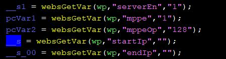
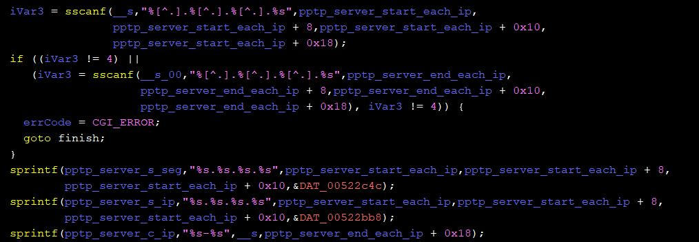
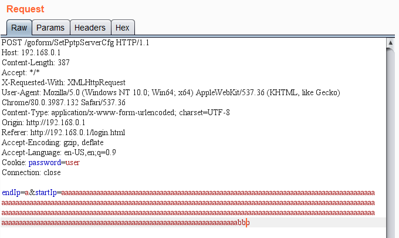

# Info
**Device:** Tenda AC10U AC-1200 router\
**Tested verison:** US_AC10UV1.0RTL_V15.03.06.48_multi_TDE01\
**By:** hnh49 of VCS
# Vulnerability
* Vulnerability exists in /goform/SetPptpServerCfg handling module, 'startIP' and 'endIp' get parsed with sprintf lead to overflow\
\

# Payload
* This payload crashes the device with $pc == 0x626262

