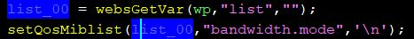
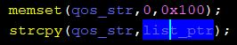

# Info
**Device:** Tenda AC10U AC-1200 router\
**Tested verison:** US_AC10UV1.0RTL_V15.03.06.48_multi_TDE01\
**By:** hnh49 of VCS
# Vulnerability
* Vulnerability exist in /goform/SetNetControlList handling module, 'list' parameter handled by setQosMibList using strcpy lead to overflow\

# Payload
* This payload executes shellcode, view script for detail.
