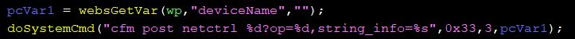
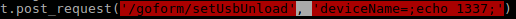

# Info
**Device:** Tenda AC10U AC-1200 router\
**Tested verison:** US_AC10UV1.0RTL_V15.03.06.48_multi_TDE01\
**By:** hnh49 of VCS
# Vulnerability
* Vulnerability exists in /goform/setUsbUnload handling module, 'deviceName' parameter is used directly in a system command\

# Payload

